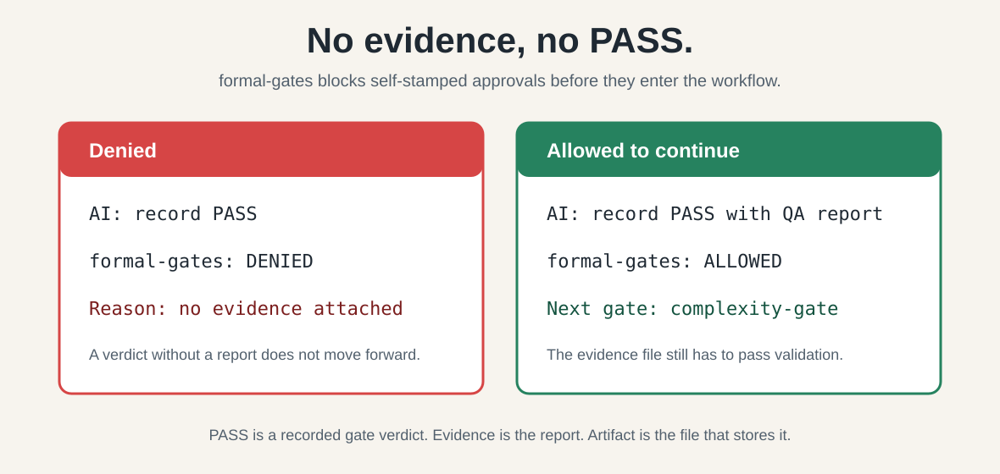

# formal-gates

> 防止 AI 自写、自审、自测，最后自己宣布 PASS。

**formal-gates** 是给 AI 开发流程用的证据门禁系统。AI 动手前先对齐需求，写完后留下独立审查和机器可校验的证据。四门可以在同一 snapshot 上并行执行，最终由机器聚合是否放行。它不替你写代码，而是裁决"方向对不对、证据够不够、能不能放行"。

**内置安装目标：** Claude Code · Codex · Cursor

不同工具的自动拦截能力不同；不能自动拦时，仍然可以用显式命令校验证据。

**当前边界：** 这个仓库目前支持本地安装和本地验证。CI 已配置为在 GitHub Release 发布时上传二进制、`portable canary` 结果和 SHA256 校验和；它还没有实现公开 registry、marketplace、`npx`、签名、provenance、attestation，或第三方可验证的 release-trust 发行链路。

---

## 目录

- [我能做什么](#我能做什么)
- [它到底拦什么？](#它到底拦什么)
- [解决什么问题](#解决什么问题)
- [四道门怎么走](#四道门怎么走)
- [核心机制](#核心机制)
- [安装](#安装)
- [环境要求](#环境要求)
- [跨平台校验](#跨平台校验)
- [包结构](#包结构)
- [许可证](#许可证)
- [更新日志](#更新日志)

---

## 一句话体验

防止 AI 自写、自审、自测代码，最后自己宣布 PASS。

## 它到底拦什么？

AI 最容易犯的一个错：代码是它写的，测试是它说跑了，最后还是它自己宣布“PASS”。

**formal-gates 做的事很简单：没有证据，就不能记录 PASS。**



### 这里的几个词是什么意思？

- **PASS**：某一道门允许继续往下走的结论。
- **Evidence**：真实测试、审查或验证留下的证据。
- **Artifact**：保存这份证据的文件，比如 QA 报告、代码质量审查报告、最终验证记录。
- **Gate**：一道审查门，比如 QA、复杂度、架构健康、代码质量。

### 术语分层

- **四门**：`qa-test-gate`、`complexity-gate`、`architecture-health-gate`、`code-quality-gate`
- **hook**：宿主拦截能力，不等于四门

换句话说，formal-gates 不相信一句“我测过了”。它要求 AI 把证据写成文件，再由命令校验这个文件能不能支撑 PASS。

### 为什么这有用？

因为它把“AI 自己觉得可以了”改成了三件可检查的事：

1. 有没有证据文件？
2. 证据文件字段是否完整？
3. 当前 workflow 和 snapshot 是否匹配？

如果缺证据、证据不完整、或者拿旧结论冒充新结论，PASS 记录会被拒绝。

想看最小例子，可以跑这个 demo：[最小 Self-PASS 阻断 Demo](examples/minimal-self-pass-block-demo.md)。

> 注意：命令被允许继续，不等于正式 PASS 已经成立。artifact 仍然必须真实存在，并通过 formal-gates 的校验。

---

## 我能做什么

| 你想做的事 | 走哪道门 |
|-----------|---------|
| 想在写 OpenSpec / PRD / SDD 之前先对齐需求 | **需求澄清门** |
| 写完代码，想验证测试用例够不够 | **qa-test-gate** |
| 担心改动做了太多、过度工程 | **complexity-gate** |
| 想检查模块边界和依赖方向 | **architecture-health-gate** |
| 想检查代码正确性、死代码、假测试 | **code-quality-gate** |
| 发版 / 封板前最终验收 | 跑完整四门 |

只有跟 AI 说"**跑四门**"、"**做 formal gate 审查**"或"**封板前过一遍门禁**"后，AI 才按 formal-gates 规则走门禁流程。能不能自动拦截违规命令，取决于你使用的工具；不能自动拦时，仍然要显式运行校验命令。

| 场景 | 是否触发门禁 |
|------|------------|
| 大重构、新系统 | 否，除非用户要求跑门禁 |
| 封板前验收 | 是，但也要用户明确要求封板或跑四门 |
| 写 OpenSpec / PRD / SDD 前 | 默认不跑正式门；先做轻量语义判断。非语义小改不问问题、不留 artifact；语义变化要先确认，才能写成正式需求。 |
| 改 UI 位置、修小 bug | 否 |
| 普通聊天、措辞调整 | 否 |

---

## 解决什么问题

AI 写代码有几个通病，这套门禁专门拦：

- **方向跑偏**——目标、范围、验收没对齐就开干，事后审得再严也是给做错的东西做精装修。
- **过度设计**——动不动造 Manager / Service / Provider / 各种抽象和"框架"。
- **假测试**——只断言"字段存在""非空字符串""日志里有某行"，而不是验证真实行为。
- **悄悄缩需求**——把用户要的范围改小，却不声明。
- **自我背书**——自己写完自己说"看起来不错"。

---

## 四道门怎么走

### 两种审查流程

**开发前审查（Pre-development）**：可选地审查 OpenSpec / PRD / 设计文档
- 流程：requirements-clarification 通过后，complexity、architecture、cold-water 三项独立检查并行
- **不需要 QA 门**（还没有代码和测试）
- 目标：在用户要求时，确认需求清晰、方向正确、架构合理、可以开工

**候选开发并行 lane**：需求冻结后，候选代码可以和 QA Design、Design Review、Design Rework 同时进行。双方保持盲态：候选开发不看 QA 草稿、结论或返修记录；QA 设计、审查和 case 编辑不看生产实现、diff、现有测试、开发者自测、实现说明或开发者解释。候选代码不能提前宣称正式验收；case set 批准后可以直接采用、修改或删除，不要求重写。

**开发后审查（Post-development）**：用户要求后，审查代码实现
- 流程：QA Execution、complexity、architecture、code-quality 四项独立审查并行
- reviewer 可以并行完成；主代理负责机械校验并串行提交共享 state，CLI 的跨进程锁会防止误并发时丢更新；FinalExecution 仍要求同一 workflow 和 target snapshot 上四门全部 PASS
- 目标：确认实现正确、测试充分、代码质量达标

如果用户已经主动开启 formal-gates，系统会按当前 artifact 判断走开发前流程还是开发后流程。没有用户要求时，不自动进入门禁。

### 需求澄清门（动手前先走的门）

如果用户要求正式需求澄清，先对齐**目标、用户价值、范围、非目标、验收标准、架构边界、需求细节**。任何一项缺失到会让文档"靠猜"，就停在 `DRAFT_BLOCKED`，不许默默填默认值。

需求细节包括：具体业务规则、边界条件、异常情况、数据约束、场景细节、非功能指标。只对齐高层目标不够——开发到一半才发现细节理解不一致，返工成本更高。

这是最适合在 AI 动手之前执行的门——方向错了返工成本最高。但它仍是用户可选项，不是默认强制流程。

改 OpenSpec、PRD、SDD、phase docs、开发计划、技术计划、实现计划、handoff 文档，以及带具体范围或验收标准的 roadmap / milestone 段落时，先做轻量语义判断。这个判断不是正式门禁：错别字、格式、标题编号这类不改变含义的改动，直接改，不问问题，也不创建 artifact；低风险澄清只使用已确认来源；会改变需求含义的改动，先确认再写进正式需求文本。

### 四道事后门（用户要求后才跑，同一 snapshot 可并行）

1. **qa-test-gate** —— 用例和验收标准是否可信，有没有真实证据。
2. **complexity-gate** —— 改动有没有做大、是否是完成目标所需的最小实现、有没有过度工程或凭空造系统。
3. **architecture-health-gate** —— 模块边界、所有权、依赖方向、状态/缓存生命周期、性能形态有没有烂。
4. **code-quality-gate** —— 正确性、边界、性能、死代码、假测试、可维护性。

四门都针对同一 workflow 和外部 VCS change snapshot 独立判断，结果可以按完成顺序处理，但共享 state 由主代理串行提交；封板前必须四门全部有当前 snapshot 的 PASS，或有本轮 Carry Arbiter 接受的逐门继承结果。返修前先确保受影响路径已被跟踪，再用现场 VCS 固定修前、修后 snapshot；Carry Arbiter 直接比较两者。无法可靠比较时，Carry 不可用，受影响门不能在没有 terminal `RERUN_REQUIRED` 的情况下进入新 snapshot 重跑。

QA 分两件事：测试用例设计由独立子代理审；开发后的测试由独立于开发者的 QA 执行者运行。主代理和 CLI 只机械核对执行证据、hash、snapshot 和 case binding，不再加第二个 QA reviewer。

---

## 核心机制

- 需要质量判断的通过结论必须由**零上下文的独立审查 AI** 给出——它不知道主 AI 的结论和怀疑点，避免回声。QA Execution 是例外：它依赖独立 QA 执行证据，由主代理和 CLI 机械核对，不做 reviewer 的 reviewer。
- **静态内容全部由脚本生成**——`prompt prepare` 生成七字段 prompt；`receipt register` 只接受角色专用的源路径参数并生成预填全部静态字段的只读 reviewer/Carry 目录，不接受调用方提供 check ID 或 gate/path binding。reviewer、Carry 和 QA Design 只提交按生成顺序排列的语义标量。Requirements owner 与 QA executor 也只能向 compose 命令提交带 1-based 位置的纯语义标量；CLI 生成 DIM/Case/Execution ID、JSON key/object/array、引用和 binding。AI 不编辑正式 JSON/QA Design Markdown，也不复述静态内容。compose/submit 在落盘前拒绝重复、缺失、越界、空值和非法枚举；失败不产生部分 artifact 或 proof，成功时原子写入并机械校验。
- **每门最多三轮**——`receipt register` 在派发前统计同一 workflow、gate 和 stage 的已完成 reviewer receipt；达到三次后默认拒绝。只有用户明确批准额外一轮时才能使用 `--user-authorized-extra-review`，主代理不能自行放行。
- **跨 workflow 隔离**——每个 workflow 的门禁链必须完整，不能复用其他 workflow 的门禁结果。系统会递归验证所有前置门和传递依赖是否属于同一个 workflowId 和 changeSnapshot；扩展门还必须绑定同一个 manifest 路径和哈希。
- 每个已启用 gate 的结论都是封闭的 schema-version-2 JSON **artifact**，由 Go 校验器检查。Markdown 只能解释，不能补充机器真值；缺字段、未知字段、非法证据或过期结论都会被拒绝。
- 配好并在当前宿主实测通过的 hook 可以拦截违规命令；使用 `formal-gates workflow` / `formal-gates gate` 记录时，机器层会校验证据并拒绝不合格的门禁记录。
- 当前内置策略可以只读导出，方便维护者确认机器执行的规则：`bin/formal-gates policy show --format json`。

---

## 可见证据

第一次验证这个包时，先看两类结果：

```bash
# 本地结构、prompt、hook decide、workflow、receipt、install 自检
bin/formal-gates canary portable --root . --format json

# 只读查看当前 Go 校验器内置策略，不会授权或记录 PASS
bin/formal-gates policy show --format json

# 可自动判定的行为用例，期望 25 个全部 PASS
bin/formal-gates behavior evaluate --root . --cases examples/skill-behavior-prompts.json --answers examples/skill-behavior-answers.json

# 只在验证 Codex 宿主自动拦截能力时运行；失败不代表 native 校验失败
bin/formal-gates canary codex-hook --worktree .
```

`portable canary` 是项目自身可控能力的主要证明。`codex-hook` 只证明当前 Codex 客户端是否真的调用 hook 并阻断违规命令；它不通过时，说明这个宿主的自动拦截没有闭环。此时仍然必须用显式的 `formal-gates workflow` / `formal-gates gate` 命令校验证据，不能宣称 Codex hook blocking proven。

`examples/skill-behavior-prompts.json` 和 `examples/skill-behavior-answers.json` 是可自动检查的 25 个行为用例，会被 package 校验和 portable canary 使用。根目录的 `test-prompts.json` 是更宽的人工/模型评测提示集，覆盖 22 个场景，不作为 package 自检的固定夹具。

维护者的完整本地自检链路见 [`references/local-validation.md`](references/local-validation.md)。

当前能说到这里：

| 工具 | 能怎么用 |
|------|----------|
| Claude Code / Cursor | 项目本地安装后，已经验证过可以拦住“没有证据就记录 PASS”的命令。 |
| Codex | 可以安装规则，也可以显式运行 formal-gates 校验证据；Codex 不提供可用的子代理 start/stop 事件，回执不会因此阻塞，也不会伪造事件。只有 `codex-hook` live canary 通过后，才可以说命令自动拦截已证明。 |

详细宿主证据和版本边界见 [`references/install-and-hooks.md`](references/install-and-hooks.md)。

---

## 发行信任边界

当前包适合本地安装、本地校验和候选包验证。CI 已配置为在 GitHub Release 发布时上传三个平台的二进制、`portable canary` 结果和 SHA256 校验和。校验和只能证明下载文件和 CI 产物一致；不要把本仓库当前状态描述成已经具备：

- 公开 registry 或 marketplace 分发；
- `npx` 一键远程安装；
- 二进制签名、provenance 或 attestation；
- 可由第三方独立验证的 release-trust 链路。

对外发布前，至少还要补齐签名或来源证明；发布页上的二进制、校验和和 `portable canary` 结果在真实发布工作流跑通后，只能说明这次构建产物能被复核，不能替代签名或 provenance。

---

## 安装

优先使用 native CLI 安装。不要只复制 `SKILL.md`；安装命令会复制运行时需要的 skill 子集，并默认写入所选宿主的完整 native hook 配置。只有明确不需要 hook 时才传 `--skip-hooks`。

```bash
# 装到全局 Claude Code，并写入 native command hook
bin/formal-gates install --source . --host claude --scope global --force

# 装到某个项目的 Codex，并写入其支持的 native hook
bin/formal-gates install --source . --host codex --scope project --project <project> --force

# 给某个项目安装 Cursor hook 支持
bin/formal-gates install --source . --host cursor --scope project --project <project> --force

# 只安装运行时，保留现有宿主 hook 配置不变
bin/formal-gates install --source . --host claude --scope global --force --skip-hooks
```

Windows 下命令名是 `bin/formal-gates.exe`。维护者本地自检链路见 [`references/local-validation.md`](references/local-validation.md)。

每个宿主必须单独安装、单独验证。一个宿主的 canary 通过，不代表另一个宿主也会执行 hook。

### Codex 注意

Codex 用户不要只靠自动拦截。除非 `formal-gates canary codex-hook --worktree <repo>` 在同一台机器、同一个 Codex 客户端上通过，否则安装后仍应显式运行 `formal-gates workflow` / `formal-gates gate`，用证据文件记录和校验 PASS。Codex 可能不产生可用的 `SubagentStart` / `SubagentStop`，因此安装器仍写入既有完整 hook 集合，但回执收口不要求这两种事件；dispatch、精确 prompt、CLI semantic submission、artifact/hash 和 closure 校验照常执行。

---

## 环境要求

- **用户运行时**：只需要对应平台的 `formal-gates` 二进制和宿主应用；核心命令不要求 PowerShell、Bash、Python、Node 或 Git Bash。
- **开发 / CI**：需要 Go 1.22+ 来构建、测试和打包原生二进制。

---

## 跨平台校验

> **前置要求**：Go 1.22+，且 `go` 在 PATH 中（运行 `go version` 确认）。

维护者本地自检链路见 [`references/local-validation.md`](references/local-validation.md)。本节只保留其余跨平台验证命令。

```bash
# 从带位置的语义标量生成 requirements 的 alignment、decision 和 PASS artifact
bin/formal-gates artifact compose-requirements \
  --root . --run-dir .gates/runs/RUN_ID \
  --workflow-id <workflow-id> --change-snapshot <snapshot> \
  --requirement-source openspec/changes/CHANGE \
  --alignment-id RQ-064 \
  --alignment 1 \
  --alignment-value '<需求或问题>' --alignment-value '<来源>' \
  --alignment-value '<重要性>' --alignment-value CONFIRMED \
  --alignment-value '<用户回答>' --alignment-value '<下游影响>' \
  --alignment-value '<文档影响>' --alignment-value '<所需证据>' \
  --user-original '<用户确认的原始表述>' --coverage-scan PASS \
  --scope-status PASS --scope-message '<scope 判断>' \
  --task-status PASS --task-message '<task proof 判断>' \
  --dimension 1 --dimension-status COVERED \
  --dimension-message '<coverage 判断>' \
  --dimension-ref 1 --dimension-ref-item 1 \
  --covered-target openspec/changes/CHANGE/alignment.md \
  --covered-target openspec/changes/CHANGE/tasks.md \
  --output-dir restricted/requirements

# 每个 alignment 重复位置和值组；dimension 组必须覆盖位置 1 到 13，
# 每个 dimension 至少用一组 ref/ref-item 关联 alignment 位置。

# 从 worker 明确提交的交付路径生成 changed-files 内容、hash 和 proof
bin/formal-gates artifact compose-changed-files \
  --root . --run-dir .gates/runs/RUN_ID \
  --workflow-id <workflow-id> --change-snapshot <external-vcs-snapshot> \
  --path internal/a.go --path README.md \
  --output restricted/changed-files.txt

# worker 新建交付文件后立即加入现场 VCS 再继续修改，修改或删除原本未跟踪的交付文件前先加入；
# 只加入明确交付路径，不运行 git add . / git add -A，不触碰无关未跟踪文件。
# 返回前确保全部交付路径已被跟踪并出现在完整 VCS diff 中。

# 从 run-local 源路径生成 context bundle；不要手写路径或 hash
bin/formal-gates artifact compose-context-bundle \
  --root . --run-dir .gates/runs/RUN_ID \
  --workflow-id <workflow-id> --change-snapshot <snapshot> \
  --output restricted/complexity/context-bundle.json \
  --input restricted/requirements/requirements.json \
  --input restricted/changed-files.txt

# QA Design registration 生成固定 Case ID 和字段目录
bin/formal-gates artifact compose-context-bundle \
  --root . --run-dir .gates/runs/RUN_ID \
  --workflow-id <workflow-id> --change-snapshot <design-snapshot> \
  --output restricted/qa-design/context-bundle.json \
  --input restricted/requirements/requirements.json
bin/formal-gates receipt register --provider codex --worktree . \
  --run-dir .gates/runs/RUN_ID \
  --context-bundle restricted/qa-design/context-bundle.json \
  --qa-case-count 6 \
  --artifact .gates/runs/RUN_ID/restricted/qa-design/cases.md \
  --gate qa-test-gate --stage Design \
  --workflow-id <workflow-id> --change-snapshot <design-snapshot>

# designer 只提交语义值；CLI 写入标题、Case ID、字段名、分隔符和末尾换行
# 每个 --design-case 后恰好按 Claim/Source/Action/Oracle/
# Failure signal/Evidence/Gap 顺序提供 7 个 --case-value
bin/formal-gates receipt submit --worktree . \
  --artifact .gates/runs/RUN_ID/restricted/qa-design/cases.md \
  --design-case 1 \
  --case-value '<claim>' --case-value '<source>' \
  --case-value '<action>' --case-value '<oracle>' \
  --case-value '<failure signal>' --case-value '<evidence>' \
  --case-value '<gap>'

# 从批准的 case set、Design Review 闭包和语义参数生成开发交接
bin/formal-gates handoff compose --root . \
  --run-dir .gates/runs/RUN_ID \
  --workflow-id <workflow-id> --change-snapshot <snapshot> --vcs <git|svn|p4|other> \
  --output restricted/development-handoff.md \
  --requirement-target openspec/changes/CHANGE \
  --verification-requirements 'go test ./... && go vet ./...' \
  --forbidden-context 'QA drafts, review conclusions, and repair history' \
  --formal-flow-mode four-gate --trigger-source 'explicit user request' \
  --qa-case-set restricted/qa-design/cases.md \
  --design-review restricted/closures/design-review.json

# 验证通过后再派发 worker；正式流程不支持无 VCS
bin/formal-gates handoff validate --root . \
  --file .gates/runs/RUN_ID/restricted/development-handoff.md \
  --workflow-id <workflow-id> --change-snapshot <snapshot>

# 校验由 CLI finalize 生成的 run-local reviewer JSON artifact
bin/formal-gates artifact validate \
  --root . \
  --file .gates/runs/RUN_ID/restricted/complexity-review.json \
  --gate complexity-gate \
  --workflow-id <workflow-id> \
  --change-snapshot <external-vcs-snapshot>

# 返修前先确保受影响路径已被跟踪，并用现场 VCS 固定修前 snapshot；
# 返修后固定修后 snapshot，Carry reviewer 直接比较两者。
# 从路由参数和机器绑定生成、校验最终发送全文
bin/formal-gates prompt prepare --root . \
  --output .gates/runs/RUN_ID/restricted/complexity/prompt.txt \
  --gate complexity-gate --current-requirement openspec/changes/CHANGE \
  --current-diff '<external VCS command that emits the complete delivery diff>' --worktree . --change-snapshot <external-vcs-snapshot> \
  --review-artifact .gates/runs/RUN_ID/restricted/complexity/review.json \
  --policy-id complexity.post-development.v2 \
  --context-bundle .gates/runs/RUN_ID/restricted/complexity/context-bundle.json

# 单独复核最终发送文件；通过后必须原样发送
bin/formal-gates prompt validate --root . --file .gates/runs/RUN_ID/restricted/complexity/prompt.txt

# 派发前由 receipt 绑定 prompt 和机器证据并生成只读 reviewer 目录
bin/formal-gates receipt register --provider codex --worktree . --run-dir .gates/runs/RUN_ID --context-bundle restricted/complexity/context-bundle.json --prompt restricted/complexity/prompt.txt --changed-files restricted/changed-files.txt --verification restricted/verification.json --artifact .gates/runs/RUN_ID/restricted/complexity-review.json --gate complexity-gate --workflow-id <workflow-id> --change-snapshot <snapshot>

# reviewer 只提交语义值；CLI 生成嵌套 JSON、PENDING verdict 和提交证明
bin/formal-gates receipt submit --worktree . --artifact .gates/runs/RUN_ID/restricted/complexity-review.json --check 1 --status PASS --message '<语义判断>' --check 2 --status REVIEW --message '<语义判断>' --finding-check 2 --finding-message '<问题>' --location-finding 1 --location-path internal/example.go --location-start 10 --location-end 12

# QA 执行者提交语义观察后，由 CLI 生成 QA-owned results 和 case binding
bin/formal-gates artifact compose-qa-owned-evidence --root . --run-dir .gates/runs/RUN_ID --workflow-id <workflow-id> --change-snapshot <snapshot> --approved-case-set restricted/qa-design/cases.md --case 1 --outcome PASS --procedure '<执行步骤>' --observation '<观察结果>' --oracle-result '<oracle 判断>' --output-dir restricted/qa-execution

# 从六个现有证据源生成机械 QA_EXECUTION；主代理不手写 envelope 或 binding
bin/formal-gates artifact compose-qa-execution --root . --run-dir .gates/runs/RUN_ID --workflow-id <workflow-id> --change-snapshot <snapshot> --output restricted/qa-execution.json --approved-case-set restricted/qa-design/cases.md --design-review restricted/closures/design-review.json --qa-owned-results restricted/qa-execution/qa-results.json --case-result-binding restricted/qa-execution/case-result-binding.json --changed-files restricted/changed-files.txt --verification restricted/verification.json

# 从脚本生成的 hop 证据生成 Carry transition chain；四个 hop 标量按位置成组重复
bin/formal-gates artifact compose-transition-chain --root . --run-dir .gates/runs/RUN_ID --workflow-id <workflow-id> --target-snapshot <snapshot-2> --output restricted/carry/transition-chain.json --hop-from <snapshot-1> --hop-to <snapshot-2> --hop-changed-files restricted/changed-files.txt --hop-verification restricted/verification.json

# worker/编排方先确保返修路径已被跟踪，再用现场 VCS 固定修前、修后快照。
# Carry reviewer 直接比较这两个快照；无法可靠比较时，受影响门不能在
# 没有 terminal RERUN_REQUIRED 的情况下进入新 snapshot 重跑。
bin/formal-gates workflow record-stage --worktree <repo> --run-dir .gates/runs/RUN_ID --gate complexity-gate --verdict PASS --artifact .gates/runs/RUN_ID/restricted/complexity-review.json --workflow-id <workflow-id> --change-snapshot <external-vcs-snapshot>
bin/formal-gates workflow verify-admission --worktree <repo> --run-dir .gates/runs/RUN_ID --gate architecture-health-gate --workflow-id <workflow-id> --change-snapshot <external-vcs-snapshot>
bin/formal-gates workflow final-verification --worktree <repo> --run-dir .gates/runs/RUN_ID --attempt-artifact .gates/runs/RUN_ID/restricted/final-verification-go-test.txt --attempt-artifact .gates/runs/RUN_ID/restricted/final-verification-go-vet.txt --output .gates/runs/RUN_ID/restricted/final-verification.json --record-final-qa --final-qa-artifact .gates/runs/RUN_ID/restricted/final-execution.json --workflow-id <workflow-id> --change-snapshot <external-vcs-snapshot>
```

每个 `--attempt-artifact` 必须是验证 runner 生成的 run-local PASS 产物；该 flag 可重复。runner 只能在命令成功退出后传入路径。CLI 会拒绝包含明确失败标记的输出：以 `FAIL`、`FAILED`、`FAILURE`、`ERROR`、`FATAL` 或 `PANIC` 开头的行、`COMMAND FAILED`/非零退出状态标记，或 Go 编译器/vet 诊断；成功的 `go build`、`go vet` 等通常无输出的命令仍可通过。被拒绝的 attempt 会生成 `FAIL` 聚合结果。聚合输出和每个 accepted attempt 的路径、hash、status、accepted 值均由 CLI 写入，AI 不得手填。同一路径的 `--output` 和 `--final-qa-artifact` 不会被覆盖；需要重跑时必须使用新的输出路径。

Windows 下命令名是 `bin/formal-gates.exe`。源码 checkout 做开发测试时，可临时用 `go run ./cmd/formal-gates`；安装后的 hook 和校验路径必须使用 `bin/formal-gates(.exe)`。

这个 native CLI 已有包结构校验、artifact 字段校验、prompt 污染校验、安装、命令拦截判断、门禁状态检查、workflow 记录与清理、receipt 记录、portable canary、Codex canary 和行为用例评测入口。它仍不是完整工作流引擎、agent 运行时、持久报告系统、缓存系统或发版可信证明系统。

---

## 包结构

```
formal-gates/
  SKILL.md                  # 入口（给 AI 读）：分流、红线、四门 ID 和最终聚合
  references/               # 各门细则（按需加载）
    requirements-clarification-gate.md
    qa-test-gate.md
    complexity-gate.md
    architecture-health-gate.md
    code-quality-gate.md
    install-and-hooks.md
  bin/                      # 本地构建出的 native CLI，不提交到 git
  cmd/                      # Go native CLI 源码
  internal/                 # Go 核心实现
  hooks/                    # dispatch prompt 污染检测规则
  agents/                   # 独立门禁审查 agent 提示词
  examples/                 # CLI demo 与行为检查样例
  formal-gates.manifest.json # 包索引和安装配置
```

人看这个 README 上手；AI 从 `SKILL.md` 进入。各门具体判据按需读 `references/`。
`examples/sample-*.json` 和 `examples/sample-*.md` 只作结构参考；正式记录必须由 `formal-gates gate` / `formal-gates workflow` 命令生成，不能直接复制样例文件。

---

## 许可证

本项目基于 **MIT 许可证**开源。详情见 [LICENSE](LICENSE) 文件。

---

## 更新日志

详细版本历史和变更记录见 [CHANGELOG.md](CHANGELOG.md)。
