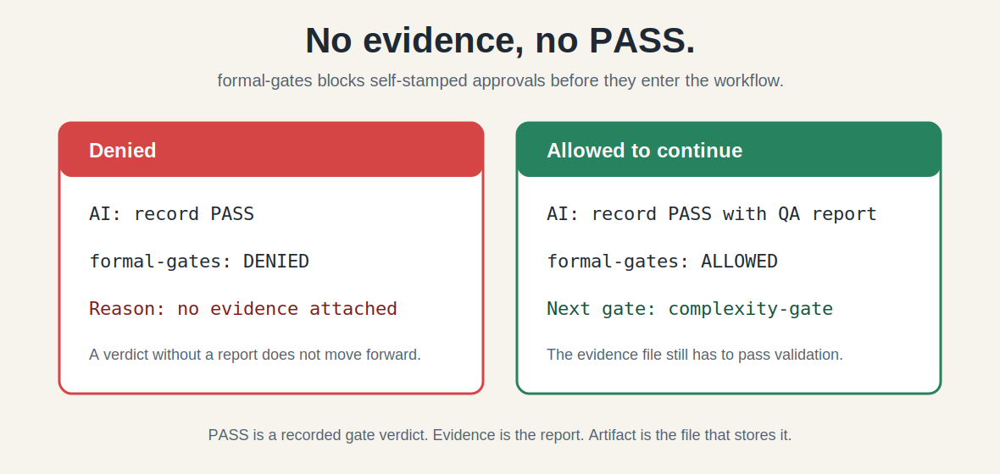

# formal-gates

> Stop AI from writing, reviewing, testing, and then declaring its own PASS.

**formal-gates** is an evidence gate system for AI development workflows. Before AI starts, requirements are aligned. After completion, independent review and machine-checkable artifacts decide whether the work can proceed or release. It does not write code for you; it judges whether the direction is right, the evidence is enough, and the result can be released.

**Built-in install targets:** Claude Code · Codex · Cursor

Per-host integration varies; actual behavior is determined by live canary.

**Current boundary:** This repository currently supports local install and local validation. It does not implement public registry, marketplace, `npx`, signing, provenance, checksum, attestation, or release-trust distribution.

---

## Table of Contents

- [One-Line Quick Start](#one-line-quick-start)
- [What Does It Block?](#what-does-it-block)
- [What Can I Do](#what-can-i-do)
- [Problems It Solves](#problems-it-solves)
- [How the Four Gates Work](#how-the-four-gates-work)
- [Core Mechanism](#core-mechanism)
- [Installation](#installation)
- [Requirements](#requirements)
- [Portable Validation](#portable-validation)
- [Package Structure](#package-structure)
- [License](#license)
- [Changelog](#changelog)

---

## One-Line Quick Start

Stop AI from writing, reviewing, testing, and then declaring its own PASS.

## What Does It Block?

The common AI failure is simple: the AI writes the code, says it tested it, and then declares its own work as "PASS."

**formal-gates keeps one rule: no evidence, no PASS record.**



### What Do These Words Mean?

- **PASS**: a gate verdict that allows work to move forward.
- **Evidence**: a real test, review, or verification result.
- **Artifact**: the file that stores that evidence, such as a QA report, code-quality review, or final verification record.
- **Gate**: one review step, such as QA, complexity, architecture health, or code quality.

In plain terms, formal-gates does not trust "I tested it." The AI has to write evidence into a file, and the command layer checks whether that file can support a PASS.

### Why Is That Useful?

It turns "the AI thinks it is done" into three checkable questions:

1. Is there an evidence file?
2. Are the evidence fields complete?
3. Does it match the current workflow and snapshot?

If evidence is missing, incomplete, or reused from an old snapshot, the PASS record is rejected.

To reproduce the smallest case, run this demo: [Minimal Self-PASS Block Demo](examples/minimal-self-pass-block-demo.en.md).

> Note: a hook decision that allows a command to continue does not mean formal PASS has been recorded. The artifact still has to exist and pass formal-gates artifact validation.

---

## What Can I Do

| What you want to do | Which gate to use |
|---------------------|-------------------|
| Align requirements before writing OpenSpec / PRD / SDD | **Requirements Clarification Gate** (optional) |
| After writing code, verify test coverage | **qa-test-gate** |
| Check if the change is over-engineered | **complexity-gate** |
| Check module boundaries and dependency direction | **architecture-health-gate** |
| Check code correctness, dead code, fake tests | **code-quality-gate** |
| Final validation before release/seal | Run all four gates in sequence |

Only after you tell the AI "**run four gates**", "**do formal gate review**", or "**validate before seal**" will it follow the installed skill rules. Whether the machine layer can block commands depends on the target host's hook config and a same-host live canary.

| Scenario | Gate required? |
|----------|---------------|
| Major refactors, new systems | No, unless the user asks for gate review |
| Pre-release/seal validation | Yes, when the user asks to seal or run four gates |
| Before writing OpenSpec / PRD / SDD | No; requirements clarification is optional pre-development review |
| UI tweaks, small bug fixes | No |
| Casual chat, wording adjustments | No |

---

## Problems It Solves

AI code generation has common pitfalls that this gate system specifically catches:

- **Direction drift**—Starting work without aligning on goals, scope, and acceptance criteria means even rigorous post-review is just polishing the wrong solution.
- **Over-engineering**—Constantly creating Manager / Service / Provider / various abstractions and "frameworks."
- **Fake tests**—Only asserting "field exists," "non-empty string," "log contains a line" instead of verifying actual behavior.
- **Silent scope reduction**—Shrinking the user's requested scope without declaration.
- **Self-endorsement**—Writing code and then saying "looks good" without independent validation.

---

## How the Four Gates Work

### Requirements Clarification Gate (optional pre-coding gate)

When the user asks for formal requirements clarification, first align on **goals, user value, scope, non-goals, acceptance criteria, architecture boundaries, and requirement details**. If any item is missing to the point where the document would rely on "guessing," it stops at `DRAFT_BLOCKED`—no silent default values allowed.

Requirement details include: specific business rules, boundary conditions, exception cases, data constraints, scenario details, non-functional metrics. High-level alignment alone is insufficient—discovering detail misalignment mid-development has even higher rework costs.

This is the best gate to run before AI starts coding, because direction errors have the highest rework cost. It is still optional and user-authorized, not automatic.

### Four Post-work Gates (run only when the user asks, in sequence)

1. **qa-test-gate** — Are test cases and acceptance criteria trustworthy? Does QA have real, owned evidence?
2. **complexity-gate** — Did the change bloat? Is it the minimum sufficient implementation? Over-engineered? Created unnecessary systems?
3. **architecture-health-gate** — Are module boundaries, ownership, dependency directions, state/cache lifecycles, and performance shape sound?
4. **code-quality-gate** — Correctness, edge cases, performance, dead code, fake tests, maintainability.

---

## Core Mechanism

- Pass verdicts must come from **zero-context independent review AI**—it doesn't know the main AI's conclusions or suspicions, avoiding echo chambers.
- Dispatch prompt pollution checks block anchoring patterns such as previous findings, just-fixed wording, focus direction, and expected answers. Rules live in `hooks/pollution-patterns.json`; `formal-gates prompt validate` is the core implementation.
- Each gate's verdict is recorded as an **artifact**, checked by the Go validator for field completeness. Missing fields, placeholders (`<...>`/`todo`/`tbd`), or reused stale conclusions are rejected.
- Cross-workflow isolation is enforced: prerequisite gates must belong to the same `workflowId` and `changeSnapshot`; extension gates also bind prerequisites to the same manifest path and hash.
- Configured and same-host live-tested hooks can block invalid commands; when using `formal-gates workflow` / `formal-gates gate` for records, the machine layer validates evidence and rejects invalid gate records.

---

## Visible Evidence

For a first verification pass, check two result types:

```bash
# Local package, prompt, hook decide, workflow, receipt, and install self-check
bin/formal-gates canary portable --root . --format json

# Run only when validating Codex host interception; failure does not mean native validation failed
bin/formal-gates canary codex-hook --worktree .
```

`portable canary` is the main proof for capabilities controlled by this package. `codex-hook` only proves whether the current Codex client actually invokes hooks. If it fails, keep using explicit `formal-gates workflow` / `formal-gates gate` evidence validation and do not claim Codex hook blocking proven.

Same-host live canary evidence currently proves this much:

| Host | Proven result | Still not claimed |
|------|---------------|-------------------|
| Claude Code 2.1.193 | Project-local hooks block PASS recording without an artifact; commands with an artifact clear the hook decision. | This does not prove the Windows global hook path, and it does not prove Codex. |
| Cursor headless 2026.06.26-7079533 | Project-local hooks block PASS recording without an artifact; a command with a real QA artifact can record gate-state successfully. | This does not prove every Cursor version or a public release-trust chain. |
| Codex CLI 0.142.0 | Native local validation works; Codex hook closed-loop interception is still not proven. | Do not claim Codex hook blocking proven. |

---

## Release Trust Boundary

The current package is suitable for local installs, local validation, and candidate package checks; it is not yet a public trust-chain release. Do not describe the current repository state as having:

- public registry or marketplace distribution;
- `npx` remote one-command installation;
- binary signatures, checksums, provenance, or attestations;
- a third-party-verifiable release-trust chain.

Before public release, add release artifacts, checksums, signatures or provenance, and save `portable canary` output as release evidence.

---

## Installation

Prefer the native CLI for installs. Do not copy only `SKILL.md`; the installer copies the runtime skill subset.

```bash
# Install to global Claude Code
bin/formal-gates install --source . --host claude --scope global --force

# Install to global Claude Code and configure native command hook
bin/formal-gates install --source . --host claude --scope global --force --configure-hooks

# Install Codex support for a project and configure native hooks
bin/formal-gates install --source . --host codex --scope project --project <project> --force --configure-hooks

# Install Cursor hook support for a project
bin/formal-gates install --source . --host cursor --scope project --project <project> --force --configure-hooks
```

On Windows, use `bin/formal-gates.exe`. After installation, run `bin/formal-gates(.exe) canary portable --root <formal-gates>` for a native self-check.

Each host must be installed and verified on its own. A passing canary on one host does not mean another host enforces hooks.

### Codex Note

This package can install a Codex skill; with `-ConfigureHook`, the installer writes Codex `hooks.json`. Codex hook files must keep only the top-level `hooks` object; do not add extra top-level fields such as `version` or `description`.

Codex hooks are only an auxiliary guardrail, not a hard enforcement gate. In the current local Windows + Codex CLI 0.142.0 test, `PreToolUse` appeared active/trusted in `/hooks`, but `codex exec` and script-launched Codex command execution still used `command_execution` and did not prove closed-loop command blocking. Formal gates must explicitly run `formal-gates workflow` / `formal-gates gate` and verify artifacts; mark Codex hook blocking as proven only after a same-host live canary observes a `PreToolUse` payload and blocks the invalid command.

---

## Requirements

- **User runtime**: the platform `formal-gates` binary and the host application. Core commands do not require PowerShell, Bash, Python, Node, or Git Bash.
- **Development / CI**: Go 1.22+ to build, test, and package native binaries.

---

## Portable Validation

> **Prerequisite**: Go 1.22+, with `go` in PATH (verify with `go version`).

A rerunnable local demo is available at [`examples/package-validation-demo.md`](examples/package-validation-demo.md). It builds `bin/formal-gates(.exe)`, then runs package validation and the native portable canary through that binary.

```bash
# Validate package structure
bin/formal-gates package validate --root .

# Run native portable canary
bin/formal-gates canary portable --root .

# Validate a specific artifact
bin/formal-gates artifact validate \
  --root . \
  --file .claude/gates/artifacts/<artifact>.md \
  --gate complexity-gate \
  --workflow-id <workflow-id> \
  --change-snapshot <snapshot>

# Validate dispatch prompt pollution
bin/formal-gates prompt validate --root . --file <prompt.md>

# Basic gate state recording and admission checks
bin/formal-gates gate record --worktree <repo> --gate qa-test-gate --verdict PASS --mode formal --stage Execution --artifact <artifact.md> --workflow-id <workflow-id> --change-snapshot <snapshot>
bin/formal-gates gate verify-admission --worktree <repo> --gate complexity-gate --workflow-id <workflow-id> --change-snapshot <snapshot>
bin/formal-gates gate show --worktree <repo> --format json

# Workflow foundation: snapshot, record-stage, verify-admission, final-verification, cleanup
bin/formal-gates workflow snapshot --worktree <repo> --vcs file-hash
bin/formal-gates workflow record-stage --worktree <repo> --gate qa-test-gate --verdict PASS --mode formal --stage Execution --artifact <artifact.md> --workflow-id <workflow-id> --change-snapshot <snapshot>
bin/formal-gates workflow verify-admission --worktree <repo> --gate complexity-gate --workflow-id <workflow-id> --change-snapshot <snapshot>
bin/formal-gates workflow final-verification --worktree <repo> --attempts-file <attempts.json> --output .claude/gates/artifacts/final-verification.json --workflow-id <workflow-id> --change-snapshot <snapshot>
bin/formal-gates workflow final-verification --worktree <repo> --attempts-file <attempts.json> --output .claude/gates/artifacts/final-verification.json --record-final-qa --final-qa-artifact .claude/gates/artifacts/final-qa-execution.md --actor <qa-reviewer> --workflow-id <workflow-id> --change-snapshot <snapshot>
bin/formal-gates workflow cleanup --worktree <repo> --dry-run
```

On Windows, use `bin/formal-gates.exe`. For development tests from a source checkout, `go run ./cmd/formal-gates` is acceptable. Installed hook and validation paths must use `bin/formal-gates(.exe)`.

This native CLI now has deterministic package validation, artifact field validation, dispatch prompt pollution checks, native install, hook decide, basic gate state checks, workflow snapshot / record-stage / verify-admission / final-verification / cleanup, FinalExecution recording from a supplied artifact, receipt register / capture / finalize / validate / preflight, portable canary, and Codex hook canary. It is still not a complete workflow engine, agent runtime, persistent report system, cache system, or release-trust system; receipt-sensitive end-to-end orchestration, same-host hook closure proof, and the release-trust chain still require separate evidence.

---

## Package Structure

```
formal-gates/
  SKILL.md                  # Entry point (for AI): routing, red lines, four-gate sequence
  references/               # Gate-specific rules (loaded on demand)
    requirements-clarification-gate.md
    qa-test-gate.md
    complexity-gate.md
    architecture-health-gate.md
    code-quality-gate.md
    install-and-hooks.md
  bin/                      # Locally built native CLI, not tracked by git
  cmd/                      # Go native CLI source
  internal/                 # Go core implementation
  hooks/                    # Dispatch prompt pollution rules
  agents/                   # Independent gate review agent prompts
  examples/                 # GateWorkflow and behavior-check prompt samples
  formal-gates.manifest.json # Package index and install config
```

Humans read this README to get started; AI enters through `SKILL.md`. Gate-specific criteria are loaded from `references/` as needed.
`examples/sample-*.json` and `examples/sample-*.md` are structural references only. Formal records must be generated through `formal-gates gate` / `formal-gates workflow`; do not copy sample files directly as state or artifacts.

> This package currently supports local install and local validation only; it does not provide public registry, marketplace, `npx`, signing, provenance, checksum, attestation, or release-trust distribution.

---

## License

This project is open source under the **MIT License**. See [LICENSE](LICENSE) for details.

---

## Changelog

For full version history and detailed changelog, see [CHANGELOG.md](CHANGELOG.md).
