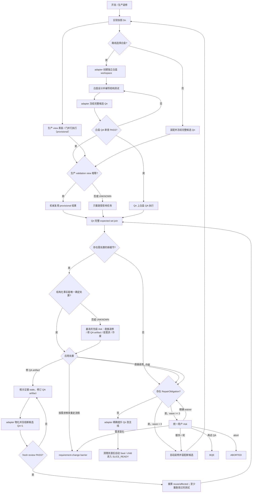
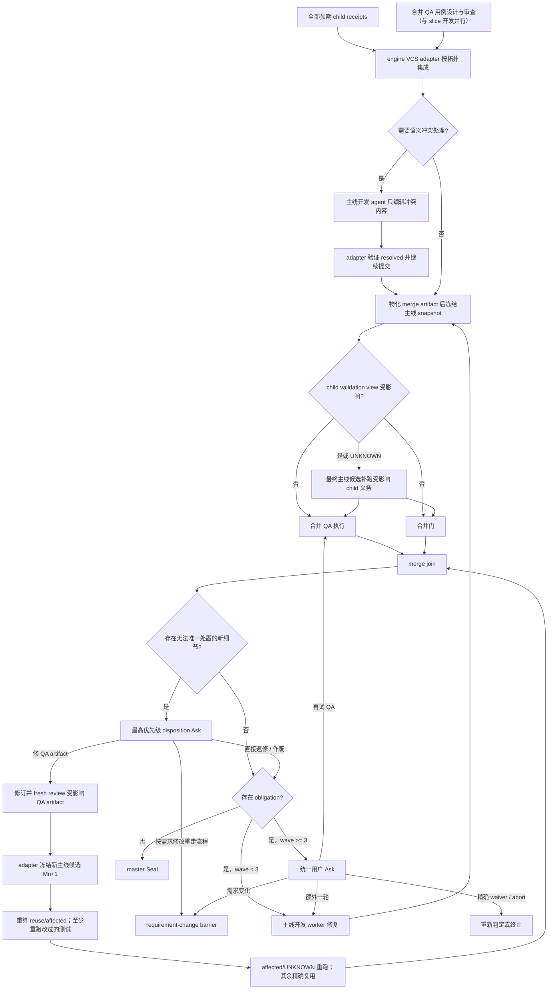

# formal-gates 确定性编排引擎最终实施方案

> 状态：完整需求与重大技术选择已由用户确认。
> 权威需求：`openspec/changes/orchestration-pipeline-engine/master-requirements.md`。
> 本文是实现方案，不再保留旧方案的兼容分支或待用户决定项；若实现细节与权威需求冲突，以权威需求为准。

## 1. 最终形态

formal-gates 从“主代理阅读流程规范并选择下一条命令”改成“Go 引擎计算完整下一步，主代理只机械搬运或呈现用户决定”。引擎是唯一流程权威，最终交付树不保留旧 run 迁移、旧公开推进命令、兼容别名、legacy mode 或 engine→legacy 回退。

两项目标等权：流程不能因漏步骤、选错分支或选择性忽略并行任务而卡死；主代理也不再消耗 token 推理下一步。验收采用结构性标准：主代理看不到迁移表和 pre 条件，不选择 Ready 子集，只接收固定、短小的类型化指令。

本次覆盖：

- regular 非分片、retained master、child、merge 和 lightweight；
- Git、SVN、P4 的非分片与分片全流程；
- Claude Code、Codex、Cursor、DeepSeek Harness 的真实 adapter 与完整 canary；
- 产品审、技术审、开发、黑盒/白盒 QA、门、修复、需求变化、中断恢复、Seal/Abort；
- 严格拒绝旧 run；不承诺 Windows/macOS/Linux 支持矩阵，但实现保持可移植。

## 2. 公共入口与控制循环

### 2.1 公共面穷举

最终只公开以下 workflow 入口：

1. `workflow start`：唯一 bootstrap 写入口。
2. `workflow drive`：无外部事件，推进到下一外部边界。
3. `workflow submit`：唯一外部事件写入口。
4. `workflow show`、`status`、`next`、`diagnose`：严格只读。

安装、卸载、hook、lifecycle、canary 与脱离 run 的快速 gate 检查仍属维护面，但不能写 workflow 状态。`drive --event`、`submit-result`、公开 `cleanup` 及所有旧推进命令全部删除；旧能力若仍需要，只能成为引擎内部 handler。

### 2.2 主循环

```text
start -> drive -> NextResult
                  | Ready/HostAction: 宿主整批执行 -> submit receipt/result
                  | Ask:             用户选择       -> submit decision
                  | Operator:        主代理核实事实 -> submit observation
                  | Wait:            等新事实       -> drive/submit
                  | Complete:        结束

每次 submit 接纳事件后立即继续 Decide/SelectIssued，直接返回新的 NextResult。
```

`NextResult` 是 tagged union，只允许 `Ready`、`HostAction`、`Ask`、`Wait`、`Operator`、`Complete` 六种 Kind。一个 canonical Plan 只能有一个 Kind，对应之外的 payload 必须为空。一个 Ready 可包含多个任务，且必须是整个 IssuedSet。

### 2.3 主动控制

route-add/reselect、需求变化、reset、abort、adopt-external、主动复审、fresh dispatch、QA 重跑和提前 waiver 都不能恢复成自由写命令。`next/status` 暴露带 freshness token 的 `availableActions`，或 `submit` 接受受限 `REQUEST_*` 事件先创建 pending Ask；用户确认后再以 request ID 提交决定。

Operator 只能核实事实和提出候选动作，不能替用户授权。

## 3. 确定性内核

### 3.1 三段式决策

1. `Observe(state, external facts)`：只读收集 VCS、文件、宿主、lifecycle、receipt 和容量事实，生成带 source bindings 的 observation。
2. `Decide(state, observation)`：纯函数，输出字节级稳定的 canonical Plan；不得包含随机 actionID 或当前时间。
3. `SelectIssued(plan, admission)`：按固定顺序和真实容量签发动作，为签发结果分配 actionID 并持久化。

迁移表只管理少量 run-level phase；动态任务由 `expectedTasks`、`TaskKey` 和 `TaskTransitionTable` 管理。单个 task 状态为 `QUEUED / ISSUED / RUNNING / VALIDATING / TERMINAL`，先推进 task，再由完整 expected set 的 join 推进 phase。

建议的 run phase：

```text
INTAKE_REGISTERED
PRODUCT_REVIEW
TECHNICAL_REVIEW
START_READINESS
TOPOLOGY_AND_ROUTE
DEVELOPMENT_PARALLEL
SNAPSHOT_READY
POST_REVIEW
REPAIR
SLICE_READY
MAINLINE_INTEGRATION
MERGE_VALIDATION
TERMINAL
```

phase 名称可在编码时微调，但合法边、用户节点和外部可观察语义不得改变。

### 3.2 程序化优先与节点内执行计划

调研 Temporal、AWS Step Functions、Argo Workflows、Airflow、LangGraph、OpenAI Agents SDK、Google ADK 2.0 和 Microsoft Agent Framework 后，采用这些系统共同支持的成熟边界：**已知控制流放在 workflow/code/DAG，非确定性语义工作才进入 agent 节点；持久化粒度跟随恢复和副作用边界，而不是把每条语句都拆成远程步骤。** 机械强制程度并不相同：传统 durable orchestrator 通常强制已声明的图/活动边界，agent 框架多为提供能力且仍可能允许模型路由或把工具错误回给模型。formal-gates 选择其中的严格子集，并额外实施定义编译、理由枚举和“禁止动态降级给代理”。

执行责任拆成两个正交维度：

| 维度 | 枚举 | 含义 |
| --- | --- | --- |
| `DecisionAuthority` | `ENGINE` / `AGENT` / `HUMAN` | 谁拥有该步输出的判断权 |
| `RunnerKind` | `ENGINE_LOCAL` / `DURABLE_ACTIVITY` / `HOST_ADAPTER` / `AGENT_WORKER` | 该步在哪里、以何种可靠性边界执行 |

HOST 不是判断权。它只提供凭据、UI、进程或外部系统能力；HUMAN 只能通过 typed Ask；AGENT 只允许以下 `nonProgrammableReason`：

- `SEMANTIC_JUDGMENT`：证据含义、影响范围、冲突意图等无法由确定性规则完备判断；
- `CREATIVE_IMPLEMENTATION`：在已确认范围内设计或编辑代码、测试、文档；
- `INDEPENDENT_REVIEW`：需要新鲜、隔离的产品/技术/QA/门审判断。

外部边界到这两个维度的映射也固定：

| 边界/步骤 | DecisionAuthority | RunnerKind | 约束 |
| --- | --- | --- | --- |
| engine handler | `ENGINE` | `ENGINE_LOCAL` / `DURABLE_ACTIVITY` | 只走定义中的 next/failure edge |
| Ready dispatch transport | `ENGINE` | `HOST_ADAPTER` | `hostBoundaryReason=AGENT_DISPATCH_API`；回 SpawnReceipt，spawn 不属于 HostAction |
| Ready worker task | `AGENT` | `AGENT_WORKER` | 必须有合法 nonProgrammableReason；回 worker result |
| Operator | `AGENT` | `AGENT_WORKER` | 当前主代理仅返回 `SEMANTIC_JUDGMENT` typed observation，不替用户授权、不执行 adapter 动作 |
| Ask | `HUMAN` | `HOST_ADAPTER` | `hostBoundaryReason=USER_IO_TRANSPORT`，只有 request 中的合法选项 |
| HostAction | `ENGINE` | `HOST_ADAPTER` | 宿主只执行已签发参数并回 receipt |
| Wait / Complete | `ENGINE` | `ENGINE_LOCAL` | 只投影状态，不产生隐藏动作 |

“实现麻烦”不是代理理由。缺程序化 adapter 时只在开发期 diagnostic compiler mode 给未完成 definition 标记 `MISSING_ENGINE_ADAPTER`，不能临时把命令顺序交给代理。该 marker 不是 RunnerKind/hostBoundaryReason：不得生成 executable StepSpec，不得签发 Ready/HostAction；normal compile/drive 以 `BLOCKED_BUG` 和 diagnose 拒绝。最终候选的本次范围内定义不得残留。可执行 HOST_ADAPTER 的合法 `hostBoundaryReason` 只有 `EXTERNAL_CAPABILITY_BOUNDARY`、`USER_IO_TRANSPORT`、`AGENT_DISPATCH_API`。

每个有顺序语义的节点编译为 `NodeExecutionPlan`。它的持久化 `StepSpec` 至少包含：

```text
id / nodeId / ordinal / dependencies
executable preconditions / postconditions
decisionAuthority / runnerKind
inputSchema / outputSchema
retryPolicy / timeout
idempotencyKeyStrategy
sideEffectProtocol / receiptPolicy
interruptPolicy
parallelGroup / joinPolicy
failureClassMap
definitionVersion
nonProgrammableReason | hostBoundaryReason（按类型必填）
```

以下任一条件成立就必须拆成 Controller 跟踪的 StepSpec：需要独立恢复、重试、超时、补偿或幂等；含不可逆副作用或 UNKNOWN receipt；跨越人/代理边界；形成 fan-out/fan-in；需要独立审计、版本或证据；崩溃恢复时必须避免重放已完成前缀。纯内存、廉价、确定性的连续变换，或能在一个原子/幂等事务中共同恢复的操作，可保留在同一 engine handler，代码顺序本身就是机械顺序。

定义编译器拒绝：不可达 step/非法循环、无类型 I/O、只写在提示词或自然语言里的 pre/postcondition、无 idempotency/reconcile 的副作用、无 request/schema 的 human wait、无 join/failure policy 的并行组、缺合法 reason 的 AGENT/HOST、任何 `MISSING_ENGINE_ADAPTER` marker、未绑定 definition version 的计划。只有显式 diagnostic compiler mode 可加载 marker 并输出诊断，不能执行。运行时只执行当前 eligible frontier，拒绝乱序、遗漏和重复 step。AGENT_WORKER 只收到当前已解锁 step 的最小输入、typed output contract 和 postcondition，不能选择后续 step。

错误不得动态降级给 agent/LLM：

| FailureClass | 唯一合法去向 |
| --- | --- |
| `TRANSIENT_ENGINE_ERROR` | 声明式 retry/backoff，耗尽后 Wait 或显式失败 |
| `BUSINESS_REJECT` | definition 中声明的业务边 |
| `USER_ACTION_REQUIRED` | Ask 或 Wait |
| `SIDE_EFFECT_UNKNOWN` | observe/reconcile，再到 Wait 或 Operator |
| `INVARIANT_VIOLATION` / `BLOCKED_BUG` | 显式失败并提供 diagnose |
| `AGENT_RECOVERABLE_SEMANTIC_ERROR` | 仅定义预先声明时进入 agent 语义修复 |

### 3.3 状态与并发写

`state.json` 继续是唯一权威工作流投影，使用原子替换、完整性摘要、快照和短时跨进程文件锁。新增并固定：

- `workflowDefinitionVersion` 与 `stateSchemaVersion`；
- 单调 `revision`，仅用于 CAS；
- `pendingActions[actionID]`；
- task/dispatch/Attempt 与 source bindings；
- pending Ask、available-action freshness、obligations、impact set；
- typed `ReviewScopeMode` 与逐项 QA approved whitelist（按 review/candidate/result 绑定）；
- split topology、`sliceID -> childRunID` 与 receipts；
- terminal summary 的最后 request/event receipt。

写事务为：读 state → Observe → Decide → 加锁重读 → 校验 revision → 重验外部 fingerprint → 持久化 intent/动作与 revision+1 → 原子保存。外部事实变化则释放锁重算，不依据过期 HEAD 或需求摘要推进。

本期不引入事件溯源、SQLite、watchdog、OS 定时器、repo 级集成队列或开放式通用 Effect/Artifact 框架。StepSpec 中的 side-effect/receipt policy 与 artifact schema 必须是定义里穷举的 typed variant，不能变成任意脚本/字符串扩展点。

### 3.4 submit 幂等与新鲜度

每个外部事件验证 event/request/action ID、当前节点、schema、payload digest、dispatch/Attempt 与 source bindings：

- 同 ID、同 digest：返回稳定 acceptance/status，不再次签发已经 ISSUED 的 SpawnRequest；
- 同 ID、不同 digest：硬拒绝；
- 新 Attempt 已建立后的旧结果：以 `OBSOLETE_RESULT` 可见拒绝；
- result-before-receipt：暂存，lifecycle 对账成功后接纳；
- 终态最后一个相同事件：由 durable summary 幂等重放结果。

## 4. 受理、用户节点与审查

### 4.1 宿主受理

普通修改请求只提醒一次可使用 formal-gates；复杂请求在完整需求/方案确认后、动手前再提醒一次。提醒均不需要用户回应，也不阻塞直接处理。

用户主动提出 formal-gates 后直接进入受理，不再重复问“是否进入正式流程”。主代理逐项澄清需求和重大技术选择，然后单独请求确认完整整合后的需求与方案；只有确认后才能 `start`。`start` 后首个 `drive` 自动登记 intake receipt/digest，不再次询问同一份确认。

若用户尚未明确，受理时选择 lightweight 或 regular。lightweight 是 bootstrap 例外，不经拆分和 full/custom 路线，登记需求后直接 Seal 并标记 unverified；regular 不能在运行中改成 lightweight。

### 4.2 正常 Ask

正常流程只在用户拥有决定权时 Ask：

1. lightweight/regular（尚未明确时）；
2. 高置信拆分建议的精确拓扑，包括边界、数量、依赖和并行度；
3. regular 非分片 run 和每个 child 的 full/custom 路线；
4. 经 Operator 核实成立的产品审/技术审每条 P0–P3 finding 的 confirm/dismiss；Ask 已附唯一完整 remedy 时 confirm 同时批准 remedy，存在多个用户拥有的修法选项时继续澄清并确认更新后的完整需求/方案。

child 路线可在界面批量接受统一默认，但状态中逐 child 保存独立决定。低置信不拆或不确定由引擎自动记录 no-split 理由，不制造无意义 Ask。

### 4.3 条件 Ask

以下只在事实或用户主动请求触发时出现：

- route-add/reselect；
- 任意 ACTIVE 非终态阶段的需求变化；
- adopt-external、带精确保留/清除预览的 reset、abort；
- 原因未知且 bindings 未变的中断：resume/fresh/abort；
- 黑盒、白盒和 merge QA 三类 pre-wave review 各自三连 FAIL 或长期不可用；
- 用户主动要求的 review override、已 PASS 复审、fresh dispatch、QA 重跑、提前精确 waiver；
- QA/门新细节无法由结构化事实唯一处置时的 `VALIDATION_DETAIL_DISPOSITION`；
- 开发后 `wave >= 3` 的统一处置；
- 长期 RUNTIME_ERROR；
- master/child 破坏性级联。

此外，任意 ACTIVE、非终态节点都提供 HUMAN 用户 typed 控制 Ask。用户可授权从当前节点跳到任意合法业务节点；请求必须记录 freshness token、request ID、requirement revision、from/to、reason 和 authorization receipt。Controller 在跳转前先 suspend/quarantine/invalidate/reconcile 受影响 Attempt、结果、候选和副作用；终止目标仍走统一 cleanup。

正常 Seal 自动执行，不额外询问。

### 4.4 产品审和技术审

reviewer 输出只是候选。Operator 对每条 P0/P1/P2/P3 核实需求前提、正常入口、复现、证据、因果、严重度和范围；无效或范围外候选直接丢弃。有效 finding 获得稳定 ID+digest，再逐项 Ask。Ask 同时记录 finding disposition 与 remedy authorization：若附带唯一、完整、无用户选择空间的 remedy，confirm 绑定两者 digest；若用户只确认问题或仍有多个有意义的产品/重大技术选项，先继续澄清、取得选择并确认更新后的完整整合文本，不能由代理自行选修法。纯机械同步不重复 Ask。

- P0/P1 confirm：来源记为 `REVIEW_FINDING_FIX`；修订后由新的零上下文代理读取完整最新文档进行新鲜复审，不得做增量 carry。
- P0/P1 dismiss：finding 作废；若无其他已确认 P0/P1，可接受候选结果，不因驳回项再派一轮。
- P2/P3 confirm：有界修订/修复；不因严重度本身复审。
- P2/P3 dismiss：作废。

产品修订改变技术前提时，产品复审 PASS 后再做新鲜技术审；技术修订改变产品语义时先回完整产品复审。后续提示词携带已拍板 finding ID，前提未变时不得原样重提。

## 5. 任意时点的用户需求变化

`REQUEST_REQUIREMENT_CHANGE` 在 Ask、Wait、Ready、Operator、产品/技术审、路线、开发、QA/门、修复、分片、主线集成和尚未完成的 Seal intent 中都可达。SEALED/ABORTED 后则创建新 run。

处理顺序固定：

1. Phase A 立即撤销未完成 Seal intent，停止新的权威 VCS/状态写入、candidate promotion 和业务任务签发。尚未有确认后的 `ImpactSet`，不得先猜哪些任务不受影响。
2. 已签发且可安全隔离、不会提交权威副作用的计算/agent 可继续到 terminal，但结果只进入 quarantine，不推进 workflow；其余安全 suspend/terminate。此阶段暂时没有 eligible 任务不违反最大并行。
3. 用户澄清并确认完整最新版需求/方案。
4. Operator 基于旧/新完整 revision 产出 changed items、transitive impacts、affected tasks/artifacts 与 carry reasons 的 `ImpactSet`；无法证明未受影响的一律 affected。
5. Phase B terminate/stale affected/unknown Attempt 和结果；恢复或接纳明确未受影响的 quarantine 结果并写 carry receipt，SelectIssued 立即按新 frontier 填满兼容容量。
6. 仅 `USER_INITIATED_CHANGE` 可用增量产品审/技术审：reviewer 读取完整文档作上下文，只重新判断变化及传递影响；影响无法可靠圈定时扩大为全量。
7. QA cases、路线、拆分、开发和验证结果按同一 ImpactSet 更新；持久化 typed `ReviewScopeMode` 规定黑盒/白盒 QA 用例或测试审查首次建立基线为 `FULL`，后续新增、修改或 ImpactSet 受影响项为 `AFFECTED`；产品审、技术审和普通质量门始终为 `FULL`，并保留未来开放用户配置的类型能力。

用户需求变化不增加或清零 run 级 repair wave；被变化打断、未形成完整 expected set 的旧 revision wave 不计数。分片由 master 统一接收和级联：未受影响 child 可 carry，受影响 child 重建或重验；已进入主线集成时，普通增量由主线开发 worker 实现，拓扑变化才重建受影响 child/map/receipt。

## 6. 强制最大并行

完整 eligible frontier 由 `expectedTasks` 计算，引擎和宿主必须满足以下不变量：

1. 可用容量为 C、eligible task 为 N 时，签发恰好 `min(C,N)` 个任务；顺序固定。
2. 主代理原样搬运完整 IssuedSet，不得挑子集。
3. receipt/result 释放容量后，`submit` 自动继续推进并补满下一批。
4. 一条支路 FAIL/RUNTIME_ERROR 不压住仍独立 eligible 的其他支路。
5. adapter 无可靠 correlation 时只可串行化尚未 attach 的 start handshake；已 ACK worker 和其他兼容容量继续并行。

关键并行组：

- 开发期：开发 worker + 黑盒 QA 用例设计/审查；
- 分片开发期：各 slice 开发 + 合并 QA 跨片用例设计/审查；
- 开发实现快照后：whitebox authoring/design/review 与所有声明为 production-only validation view 的黑盒执行/selected gates 同时 eligible；后者先生成 provisional result；
- 完整候选冻结后：白盒执行、尚未运行和 validation view 已变化/UNKNOWN 的任务同时 eligible；旧/新 view 精确相等的 provisional result 由 receipt 直接纳入最终候选 expected set；
- 合并后：合并 QA 执行 + 合并门；
- 修复后：所有受影响且依赖满足的验证再次最大 fan-out。

投机执行不是提前冒充权威结果：它只有在最终候选形成后、由 Controller 机械证明声明 validation view 精确相等时才成为权威证据；不同或 UNKNOWN 只重跑受影响项。最大并行约束所有当前确实有机会进入最终 expected set 的任务，不能因等待白盒编写而闲置生产验证容量。

## 7. 开发后 QA、门与三轮



QA/门返回开发后新细节时，Controller 先用 FailureClass、producing task kind、artifact ownership 与 typed receipt 计算合法处置集，不派 AI 判根因。唯一分支机械执行；多分支或 UNKNOWN 时，`VALIDATION_DETAIL_DISPOSITION` Ask 让用户在 `DIRECT_REPAIR`、`QA_ARTIFACT_REPAIR`、`REQUEST_REQUIREMENT_CHANGE`、`DISMISS` 中选择。pending 时不形成 obligation、当前 batch 标记 `AWAITING_DISPOSITION` 且不计 wave。直接返修才形成 obligation 并结算本轮；需求修改进入用户主动变化 barrier；作废不形成 obligation。这个 Ask 的优先级高于前三轮不问用户。

`QA_ARTIFACT_REPAIR` 不能回旧 `Qn` join。Controller 使旧 artifact/result/binding stale，在对应隔离 workspace 修订；adapter 把修订后的用例、测试和辅助 artifact 物化进新不可变 `Qn+1`，再由 fresh review 审查该候选。review 通过后，Controller 依据 `Qn → Qn+1` 差异和依赖图重算 reuse/affected：改过的测试至少重跑自身；公共 helper、fixture、harness、配置或发现规则变化时重跑所有依赖测试；UNKNOWN 按受影响。黑盒、门和其他测试只有 view digest 精确相等才凭 receipt 沿用。新 expected set 只绑定 `Qn+1`，全部 terminal 后再 join；artifact 修订不增加 development repair wave，替代候选只结算一次 logical wave。无法证明 QA-only 则转直接返修或重新 Ask。

处置唯一确定或用户选择直接返修后，经正常入口与范围核实的 QA FAIL、gate P0/P1/P2/P3 形成 `RepairObligation`。gate 有 P2/P3 时权威结果仍可为 PASS，但 obligation 与 gate status 分离；范围外 P3 只作建议，不形成 obligation。

首次在同一完整 candidate 上的 expected set 为 wave 1；每个修复 candidate 的完整 expected set 再计一轮。白盒候选装配/review、`AWAITING_DISPOSITION`、PENDING、RUNTIME_ERROR、缺 receipt 和被需求变化打断的不完整轮都不计数。

- `wave < 3` 且有已完成处置的 obligation：自动派开发 worker 修复，P2/P3-only 也不问用户；未定处置 Ask 是最高优先级例外。
- `wave >= 3` 且有 obligation：一个 Ask 同时提供恰好一轮额外修复、再试 QA、逐 obligation waiver、用户需求变化、abort；额外轮仍失败则重复同型 Ask。
- QA review/execution scope follows the persisted typed `ReviewScopeMode`: first baseline `FULL`, then `AFFECTED` only for new, modified, or ImpactSet-affected items; product review, technical review, and ordinary quality gates remain `FULL`. Scope is not user-selected during the first three waves.
- RUNTIME_ERROR 不算 finding、不计 wave；安全重试自动进行，长期不可恢复才 Ask retry/skip/change/abort。

waiver 必须绑定当前 validation candidate、request、精确 obligation ID 和理由；PENDING 不可 waiver，后续候选不继承旧 waiver。

### 7.1 完整候选与晚提升

每轮先冻结只含实现的 `DevelopmentSnapshot Dn`。选择白盒时，由 VCS adapter 从精确 `Dn` 创建已登记的独立 authoring workspace；白盒设计 agent 可新增/修改/删除被 `TestOwnershipResolver` 证明为 test-owned 的测试、辅助代码、fixture 与 case 内容并返回 manifest，Controller 校验后由 adapter track/open、commit/submit，冻结原生不可变的 `ValidationCandidate Qn`。`Qn` 必须同时包含实现、白盒测试代码及所有要纳入 VCS 的已批准最终 artifact。未选白盒时，Controller 仍在验证前物化这些 artifact，并令 `Qn` 等于装配后的实现候选。

VCS adapter 输出 `Dn→Qn` 全部 added/modified/deleted/renamed 路径与内容摘要；`TestOwnershipResolver` 结合项目/测试框架配置、路径/命名规则、测试发现和生产构建输入分类。名字带 `test` 不是充分条件，名字不带 `test` 也不自动排除；只有全部差异均 test-owned，且生产代码、运行配置、生产依赖、构建输入与 provider 元数据投影相等，才证明 production validation view 未变，UNKNOWN 按受影响处理。

黑盒和允许提前运行的门在 `Dn` 上声明并绑定各自的 validation view 后即可与白盒 authoring/review 并行。黑盒 view 覆盖被测生产代码/制品、运行配置、生产依赖、工具和环境；实现质量门 view 只覆盖生产实现及需求/方案上下文，测试代码质量由白盒 review 独占。最终 `Qn` 形成后，`ValidationViewReuseReceipt` 记录 D/Q identity、diff、resolver/version、两端 view digest 和 affected task set：相等则 provisional result 机械映射到 `Qn`，不同或 UNKNOWN 则只重跑受影响任务。不得由 agent 口头声明 test-only/carry。

白盒 review 读取完整 `Qn`；FAIL 只回设计/装配形成新候选，不计开发后 wave。其连续失败受统一 pre-wave policy 约束。若白盒 agent 需要修改生产代码或无法证明 test-only，必须转回 development/repair 形成新 `Dn`。最终 expected set 统一归属于 `Qn`，由 Q 上直接结果和有精确 reuse receipt 的 provisional result 构成。

完整 wave 无 obligation 后，adapter 才把整个 `Qn` 提升到主线。Git 能 fast-forward 时保留同一 identity；SVN/P4 或其他 Git integration 产生最终身份 `F` 时，只有 typed `CandidatePromotionReceipt` 证明 source/target identity、预期 target base、完整路径与 provider 元数据、operation id、无冲突，以及 `validatedDigest(Qn) == finalDigest(F)`，整组结果才可映射到 `F`。这不是逐门 carry。若出现冲突、转换、目标漂移、UNKNOWN 或 digest 不等价，先 reconcile，再把实际结果冻结成新候选并重跑受影响验证。

repair 的生产改动先形成新 `Dn`，再从它重建/对账 whitebox workspace；测试改动仍走独立白盒设计链。新 `Qn` 冻结后按持久化 `ReviewScopeMode` 计算：首次基线 FULL，后续新增/修改/ImpactSet 受影响项 AFFECTED；产品审、技术审和普通质量门始终 FULL。每个 child 在 `SLICE_READY` 前先完成同样的候选提升，使 receipt 直接绑定已包含白盒测试的最终 child identity。

开发后处置中的 QA artifact 修订也走完整候选链：旧 `Qn` → 隔离修订/fresh review → adapter 冻结 `Qn+1` → 重算 view/reuse/affected → 至少执行变更测试及所有受依赖影响测试 → `Qn+1` join。不得把“不是生产返修”解释为可跳过新候选。

黑盒 case review、白盒 test/case review、merge QA case review 使用同一确定性 `PreWaveReviewPolicy`，并持久化 typed `ReviewScopeMode`：首次建立基线为 `FULL`，后续新增、修改或 ImpactSet 受影响项为 `AFFECTED`；产品审、技术审和普通质量门始终为 `FULL`。QA case/test review 与 execution 均逐项使用 approved whitelist；缺失、未知、重复条目或仅总体 PASS 的结果拒绝，只有每项明确 `PASS` 才进入持久化 approved whitelist。按 run/child、review kind、requirement revision 与 route/topology scope 分别计数。第 1、2 次语义 FAIL 自动重新设计并使用 fresh reviewer；第 3 次 FAIL 或长期不可用才 Ask fresh redesign、重试/fresh review、改需求、对精确 case-set/candidate 带理由 waiver/skip，或 abort。PASS 关闭/重置 series，runtime error 不累计；这些尝试不计开发后 wave。

## 8. 分片、主线合并与 VCS

### 8.1 生命周期

`start --split yes|no` 只冻结 split intent。no-split 不得静默改 split；retained master 在 start-readiness 后确认精确拓扑，也不得静默变成 no-split。冲突进入需求变化、reset/rebuild 或 abort。

master 确认拓扑后，Controller 执行固定 child-creation plan：ENGINE_LOCAL 持久化 intent、分配 childRunID、创建 PREPARING child state 并注入 bindings；每个 Git/SVN/P4 workspace/client 再由 VCS adapter 独立 StepSpec 创建/对账；ENGINE 校验全部 typed receipts/identity 后，才原子提交 `sliceID -> childRunID` map 并解锁 child。child 继承完整产品/技术审和拓扑，各自持久化 full/custom 路线。

child 达标后进入可恢复 `SLICE_READY`，不独立最终 SEALED、不删除恢复信息。durable receipt 至少包含：

- 状态、child/slice/master ID；
- workflow/state schema version；
- 已包含白盒测试的最终 child VCS identity、tree/validation digest 与 candidate-promotion receipt；
- requirement/topology/route bindings；
- QA/门结果、批准 cases、cost；
- 最后 request/event digest 和幂等结果。

master 只按持久 map 接受预期 receipt，不扫描任意 sidecar 猜测 child 完成。child abort 产生 ABORTED receipt 并阻塞 master；master 的 abort/reset/重大需求变化按用户授权级联，不留 orphan。

### 8.2 合并路径



合并后始终跑合并 QA 与合并门。无法唯一确定新细节处置时，先执行最高优先级 `VALIDATION_DETAIL_DISPOSITION` Ask；用户选直接返修后才由主线开发 worker 修复，不回 child、不重新 Seal child、不重复路线或澄清。用户选修 QA artifact 时，必须在主线物化修改并冻结新候选，至少 fresh review/重跑改过的 merge 测试或用例，共享组件变化时扩大到所有依赖项；随后重新计算 merge gate、merge QA 和 child obligation 的 reuse/affected，不能直接回旧候选执行。每次冲突处置/主线 repair 后，Controller 用 topology ownership、VCS diff 和 child receipt 的 validation view 计算 `AffectedChildSet`：只改 integration-owned glue/跨片接缝且 child view 全部精确相等时，仍只重跑合并双验证；改变 child-owned 内容或 UNKNOWN 时，在同一最终主线候选上额外补跑对应 child 受影响的黑盒、白盒与普通门义务，再与合并双验证 join。合并流程使用同一 wave 计数规则：处置完成后 `wave >= 3` 才作三轮 Ask。

### 8.3 VCS adapter

统一接口程序化覆盖 provider 探测、根/身份解析、status/diff/untracked 识别、base/current/ancestry、child workspace/client、显式 track/add/open/reopen、resolve 状态、integrate、commit/submit、snapshot、final identity、已授权 reset/rollback、cleanup 和 crash reconcile：

- Git：worktree/branch、集成和 Seal squash；
- SVN：working copy、revision 与集成，不 squash；
- P4：client/workspace、changelist 与集成，不 squash。

开发/修复 agent 只编辑已授权内容，返回声明式路径 manifest、语义说明和 typed result；Controller 校验后由 adapter 执行 VCS 写操作。确定性构建/测试也优先由 engine runner 执行；只有测试设计或实现本身需要语义创造时才成为 AGENT step。

冲突路径严格固定：adapter 发起 integrate 并输出精确冲突集 → 若需要语义选择，主线开发 agent 只修改冲突内容 → adapter 验证 resolved → adapter 执行 resolve/add/open、commit/submit、snapshot 和确定性验证。agent 不运行 VCS 写命令、不决定集成顺序，也不把冲突退回 child。

reviewer/QA 读取 Controller 生成的只读 snapshot/diff artifact；artifact 绑定 provider、base/current、definition version 和 digest。reviewer 不自行推断 VCS 当前态、不执行 VCS 写操作。凭据/外部能力可通过 typed HostAction 执行，但宿主只能执行已签发参数，不能自造或重排命令。

whitebox authoring workspace、完整候选 freeze 和候选 promotion 也属于同一 VCS adapter 契约。promotion receipt 的 canonical validation view 对 Git 覆盖 tree/blob/mode 与相关引用，对 SVN 覆盖 path@revision、内容与 properties，对 P4 覆盖 depot paths、submitted changelist、filetypes 和 view；只比较工作区字节或只贴 `test-only` 标签均不足以把验证映射到最终身份。

检测外部漂移时，adapter 先冻结 observed identity、lineage、只读 diff 和 `ExternalAdoptionPreview`。adopt-external Ask 必须绑定该精确 identity；授权后保留原 run base，把外部 identity 设为新 current/development source，并写含旧/新 identity、request、preview、ImpactSet、invalidations/carry 的 `ExternalAdoptionReceipt`。affected/UNKNOWN Attempt、result、candidate、waiver、promotion intent 与 child receipt/map stale；明确未受影响项才 carry，未完成 wave 不计、已完成 run wave 不清零。需求 artifact 的语义变化转入 `REQUEST_REQUIREMENT_CHANGE`，lineage/identity 不唯一进入 Operator/Wait/reset/abort；分片只级联受影响 child 与 merge bindings。

所有非幂等 VCS 操作使用 intent/reconcile 协议，adapter 返回结构化 facts，流程层不得解析人类文本猜结果。adapter 错误只进入预声明的 retry、Wait、Operator 或显式失败；绝不改派 agent 猜测。

## 9. 宿主动作、中断与本地副作用

### 9.1 HostAction

spawn 只走 Ready。HostAction 是封闭 typed union：`RESUME_AGENT | TERMINATE_AGENT | EXECUTE_ADAPTER_OPERATION`；最后一类只引用 definition 注册的 adapter operation 和参数 schema，不能携自由 shell。每个动作先持久化 pending intent，再交给宿主。公共 receipt 字段为 actionID、operation、payload digest、宿主/provider、correlation 和 status；resume/terminate 另带 lifecycle evidence，adapter operation 另带其 schema 规定的结构化 observation/identity evidence。

provider identity、bridge installed/available 和 lifecycle paired status 分开记录。宿主是什么就绑定什么；bridge 缺失不得降级成 default。已安装桥但事件缺失先 Wait/对账，最终可 REJECTED/Operator；provider mismatch 硬拒绝。

中断与 UNKNOWN 分开处理：

- 客观瞬态且 bindings 未变：自动 resume 原 Attempt；
- 任务/snapshot/责任变化或已知非瞬态：自动新 Attempt，旧 Attempt terminate/stale；
- bindings 未变但原因未知：Ask resume/fresh/abort；
- receipt UNKNOWN：先查 lifecycle，唯一匹配自动 attach，多重/无匹配进 Operator，绝不盲目 respawn。

### 9.2 本地副作用

start、prompt/artifact、blackbox/whitebox QA worktree、case mirror/materialize、完整候选 freeze/promotion、Git/SVN/P4 workspace/集成/提交、snapshot、Git squash、child receipt/cost、terminal summary、cleanup、abort 全部采用 StepSpec 与：

```text
persist intent -> execute -> observe/reconcile -> commit result
```

外部事实仍为旧状态时执行；已精确满足预期时只提交结果；冲突进 Operator；retryable I/O 进 Wait。不得盲目重复 spawn、squash 或集成。

批准的黑盒 cases、白盒测试和其他 VCS 内交付 artifact 在 `ValidationCandidate` 冻结前物化。Git 从 base 到 current 超过一条提交时自动 squash，消息由 engine 稳定派生，不新增 Ask；SVN/P4 不 squash。squash 只有在 tree/validation-view identity 保持等价时才沿用候选验证。

Controller 维护持久化 typed resource registry，登记每个 blackbox/whitebox/child/merge workspace、Git 临时 ref/branch、SVN working copy/候选路径、P4 client/pending changelist 及 cleanup state。Seal/Abort 固定执行：持久化 terminal intent 与可恢复 summary → adapter 逐项 cleanup → observe/reconcile → 写 `WorkspaceCleanupReceipt` → 核验无应回收登记残留 → Complete。cleanup 未完成时保持 `FINALIZING_CLEANUP`，不能先对外宣布 Seal 完成。promotion UNKNOWN 必须先对账，不能重复 merge 或未授权 rollback。

## 10. 旧 run、终态与诊断

正常 loader 先最小读取版本 envelope。缺 `workflowDefinitionVersion`、缺 `stateSchemaVersion` 或任一不精确匹配，均返回 `UNSUPPORTED_RUN_VERSION`，且绝不写状态。

不实现 migrate、兼容读取、旧命令续跑、legacy mode、`controlMode` 第二值或 authority handoff。旧 run 文件原样保留供只读诊断，用户使用新 ID 创建当前版本 run。

`diagnose` 绕过正常 decoder，只读报告路径、JSON 可读性、检测到的版本、当前支持版本、summary、可安全判断的 integrity 和重建建议。它不修复、不迁移、不清理。

Seal/Abort 终结路径先写 durable intent/可恢复 summary，再自动清理登记的临时资源；只有 cleanup receipt 完整且无残留后才提交 SEALED/ABORTED summary/receipt，`show/status/next` 可从 summary 回落，`next` 返回 Complete。活动 run 的 reset/abort 必须由 available action → Ask → submit 授权；不保留公开 cleanup 后门。

## 11. 实施顺序

### 阶段 0：冻结契约

- 把权威需求、本方案、SKILL 和所有参考文档统一成同一语义。
- 为最终公共命令面、旧 run 拒绝、用户节点、StepSpec/失败分类、parallel frontier、三轮和 split receipts 建 contract fixtures。
- 冻结当前正常使用中仍需由内部 handler 承接的业务语义，不冻结旧命令形态或兼容行为。
- 只为未来版本化 engine/candidate surface 冻结 state/definition version envelope 与缺失/不匹配 fixture；stable driver 和既有 legacy run 继续沿用当前 state 格式及写入语义，严格版本拒绝在 engine surface 可用后才生效。

### 阶段 1：纯决策内核

- 实现版本 envelope、RunPhase、TaskKey、TaskTransitionTable、Observe/Decide/SelectIssued 和 NextResult 校验。
- 实现 NodeExecutionPlan/StepSpec schema、定义编译器、eligible-step runtime 与 DecisionAuthority/RunnerKind policy。
- 用 golden traces/property tests 覆盖合法边、非法事件、step 顺序/遗漏/重复、非终态无空结果和 canonical Plan 字节稳定。
- 先以只读 shadow 比较 eligible frontier、完整 fan-out、依赖顺序和最终投影；telemetry 不写权威 state。

### 阶段 2：可靠写入与动作协议

- 实现 file lock、revision CAS、external fingerprint 重验、pendingActions 和 submit 幂等。
- 实现 SpawnReceipt、worker result、Ask/Operator event、lifecycle event 的统一接纳。
- 实现 failure-class 路由、UNKNOWN、中断、旧 Attempt、result-before-receipt 和本地 effect 对账，测试 engine 故障不会动态降级为 agent。

### 阶段 3：完整流程迁移

- 迁移 intake、产品/技术审、start-readiness、路线、两阶段需求变化、开发、白盒独立 authoring/完整候选、production-view 并行/reuse、白盒执行、repair、精确 promotion、adopt-external 和 Seal cleanup；同步修改 `gates/implementation-quality-gate.md`、catalog scope 与 README，移除实现质量门的测试代码审查责任，测试质量只由白盒 review 承担。
- 强制完整 frontier 与自动 refill。
- 迁移 lightweight 例外和三轮规则。

### 阶段 4：split 与三 VCS

- engine 内建 child、map、SLICE_READY、receipt、case/cost 汇总和级联。
- 实现 Git/SVN/P4 非分片及分片 adapter 的完整机械面和只读 diff artifact。
- 实现合并 QA 预设计、adapter 主线集成、语义冲突窄 agent 边界、合并双验证和主线返修循环。

### 阶段 5：删除旧逻辑

- 将仍需能力内收为 handler 后，删除所有旧公开推进命令和别名。
- 删除旧 run decoder/migration、legacy mode、authority handoff、legacy QA、旧 guard/hook 门禁、公开 cleanup 与废弃提醒。
- 删除或按当前契约重写仍断言旧受理模型、旧复审文案和旧 lightweight 语义的测试；禁止为了让旧测试变绿而恢复已废弃文本或行为。
- 扫描 CLI 注册表、源代码、文档和测试，证明无第二权威路径。

### 阶段 6：最终 canary 与安装

- 从清理完成的同一最终 candidate revision 构建隔离安装副本。
- 完成全部权威 canary；中途修复会产生新 revision 时，所有最终证据统一重跑，不拼接旧候选结果。
- 当前稳定安装继续驱动本次 `orch-engine-003`，只作为开发期外部兜底。
- 当前 run Seal 且最终候选全量 PASS 后，才安装最新版到全局并退役稳定兜底。

## 12. 测试与 canary 矩阵

### 12.1 自动测试

1. 每条迁移边、pre 拒绝、Ask/Operator/Wait/Ready/HostAction/Complete。
2. StepSpec 编译器拒绝非法图、untyped I/O、自然语言-only pre/postcondition、无可靠副作用协议、无 join/failure policy、非法 reason 与缺版本计划。
3. runtime 拒绝 step 乱序/遗漏/重复；崩溃只恢复未完成边界，不重放已完成副作用；原子纯 handler 不被过度拆分。
4. 每个 FailureClass 只走声明边，engine/adapter 故障不动态降级 agent；AGENT 只出现于三种合法 nonProgrammableReason；最终本次范围内定义不存在 `MISSING_ENGINE_ADAPTER`。
5. stable TaskKey、完整 expected set、`min(C,N)`、自动 refill、分支失败不压兄弟任务。
6. 同 action/event/request 幂等、不同 digest 拒绝、并发 submit、旧 Attempt 和 result-before-receipt。
7. 任意非终态节点触发用户需求变化，含 Phase A 权威写屏障/quarantine、确认后 ImpactSet、unknown=affected、Phase B 恢复/refill、增量复审和 wave 不误计。
8. 产品/技术审 P0–P3 confirm/dismiss、finding/remedy 授权绑定、P0/P1 新鲜复审、P2/P3 无级别强制复审。
9. 三类 pre-wave review 独立计数；whitebox workspace/新测试识别/完整候选 freeze/review；production validation 与白盒 authoring 并行、view 等价 reuse；验证细节唯一处置/歧义 Ask 四分支与最高优先级；QA artifact 修改后 ordinary/child/merge 都冻结替代候选、至少 fresh review/重跑变更测试、共享依赖扩大、重新计算 reuse/affected 后新候选 join；开发后 wave 1–3、P2/P3-only 自动修、`wave >= 3` 统一 Ask；ReviewScopeMode 首次基线 FULL、后续新增/修改/ImpactSet 受影响项 AFFECTED，产品审/技术审/普通质量门始终 FULL。
10. split map、包含白盒测试的 child 最终 identity、SLICE_READY、durable receipt、child abort、级联、case/cost 汇总、adapter 集成、语义冲突窄 agent 边界、AffectedChildSet 与主线精确补验。
11. Git/SVN/P4 的 provider/status/diff/track/integrate/commit/snapshot、whitebox workspace、candidate freeze/reuse/promotion、adopt-external、resource cleanup、typed artifacts、错误对账，以及代理无法执行 VCS 写操作。
12. 版本缺失/不匹配严格拒绝；diagnose 原始只读；终态 summary 回落。
13. 正常入口与常见误操作黑盒；范围外对抗输入、手工状态编辑、权限/不可变文件和未支持 OS 只作 P3 建议。

### 12.2 确定性崩溃测试

用 fake host/VCS adapter 在每个持久 StepSpec 边界逐点注入：intent 前后、spawn 后 attach 前、result 先于 receipt、submit 成功但响应丢失、临时文件 sync/replace 前后、两个并发 submit、旧 Attempt 迟到、whitebox workspace 创建后登记前、candidate freeze/promotion 后 receipt 前、track/commit/integrate 后 receipt 前、Git squash 后 state 保存前、child SLICE_READY 后 master 集成前、语义冲突编辑后 resolved 校验前、cleanup 每个资源后 registry 提交前、merge QA/门记录前。

### 12.3 权威完整 canary

VCS 六格全部跑通：

| VCS | 非分片 full | 分片 master/child/merge full |
| --- | --- | --- |
| Git | 必须 | 必须 |
| SVN | 必须 | 必须 |
| P4 | 必须 | 必须 |

四个宿主各自在真实环境跑一次 Git 非分片 full：产品审 → start-readiness → 开发与黑盒设计并行 → 实现 snapshot → whitebox workspace/design/review 与 production-view 黑盒/门并行 → freeze 完整候选 → test-only/view 等价 reuse 或精确重跑 → 白盒执行 → 真实或注入 FAIL → repair/新候选 → 重验 → promotion 中断/恢复 → 无残留 cleanup → Seal。每次保存 provider/bridge、SpawnRequest/Receipt、worker result、revision、candidate/reuse/promotion/cleanup receipt、结果和 Seal 证据。

允许一个宿主 Git 非分片 canary 与 VCS 六格中的 Git 非分片重叠，因此最低是 9 个完整 canary，而不是 24 个笛卡尔积。hook-only、lifecycle-only、lightweight 或 smoke 均不能替代任何完整 canary。

## 13. 完成判定

只有以下条件同时成立才安装最终最新版：

1. 相同 state+observation 的 canonical Plan 字节稳定，非终态无静默死端。
2. 每个有顺序语义的节点由编译后的 StepSpec/engine handler 机械执行，乱序、遗漏、重复和未声明失败边不可发生。
3. 可程序化动作不落入 agent；engine/VCS adapter 故障不动态降级 agent；AGENT/HOST 均有合法、可审计理由。
4. 并行任务无漏派、无选择性忽略、无容量闲置；未形成完整候选的验证不会被错误标为 eligible，完整候选就绪后全部验证立即并发。
5. HostAction、本地副作用和所有确定性崩溃窗可恢复或明确进入 Operator。
6. 用户节点、验证细节歧义处置的最高优先级 Ask、任意时点需求变化、审查来源规则和三轮规则全部有可复现证据。
7. Git/SVN/P4 六格与四宿主 canary 全部绑定同一最终 candidate revision/安装副本并 PASS。
8. 最终树不存在旧 run 兼容、迁移、旧公开入口、双写入口、legacy 回退或 cleanup 后门。
9. 独立产品审、技术审、QA 和所有选定门按 formal-gates 完成，当前开发 run Seal。
10. `go test ./...` 在不恢复过时受理/复审/lightweight 断言的前提下全部 PASS；基线中已确认的旧文本断言已删除或改写为当前 engine 契约。

实现中的字段名、包拆分和内部 phase 名称可以在不改变上述可观察语义的前提下由开发者确定；不再存在需要用户补选的产品或路线开放项。
