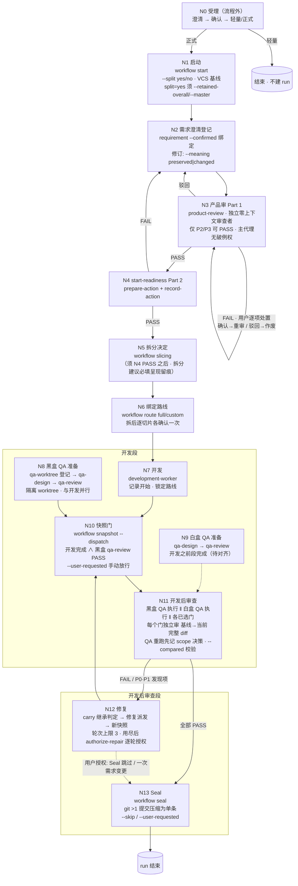

# formal-gates 工作流拓扑（现状）

> 目的：**逐节点对齐规则的锚点图**。这是现状拓扑（唯一依据：SKILL.md 九步 + references/formal-flow.md），不是改造后方案。
> 节点编号 = 后续规则对齐的锚点；对完规则之后再谈硬流水线化（见 [HARD-PIPELINE-TRANSFORMATION.md](HARD-PIPELINE-TRANSFORMATION.md)）。

## 一、主流程拓扑图

## 二、节点清单（规则对齐锚点）

| 节点 | 名称 | 触发命令 | 前置依赖 | 出边 | 并行关系 | 决策/分支 |
|---|---|---|---|---|---|---|
| N0 | 受理（流程外） | 无 CLI | — | N1 / 结束 | — | 澄清 → 确认 → 路线选择 |
| N1 | 启动 | `workflow start` | 已确认需求已持久化 | N2 | — | `--split yes/no` 强制声明；无 VCS 拒绝 |
| N2 | 需求澄清登记 | `requirement --confirmed` | N1 | N3 | — | 修订分类 `--meaning preserved\|changed` |
| N3 | 产品审 | `prepare-action`+`record-action` (product-review) | N2 | N4 / N3↺ / N2 | — | 仅 P2/P3 可 PASS；P0/P1 用户逐项处置（确认→重审、驳回→作废） |
| N4 | start-readiness | `prepare-action`+`record-action` | N3 PASS | N5 / N2 | — | PASS / FAIL（FAIL 回 N2，黑盒用例增量修订） |
| N5 | 拆分决定 | `workflow slicing` | N4 PASS | N6 | — | 拆/不拆（高置信要拆才需用户确认方案） |
| N6 | 绑定路线 | `workflow route full\|custom` | N5 | N7 | — | 单一 run 一次、拆后逐切片各一次 |
| N7 | 开发 | `development-worker` | N6 | N10 | 与 N8 并行 | 锁定路线；子代理只做已确认范围内工作 |
| N8 | 黑盒 QA 准备 | `qa-worktree` → `qa-design` → `qa-review` | N4 后即可 | N10 | 与 N7 并行 | 用例增删改；review PASS 是快照门的一半 |
| N9 | 白盒 QA 准备 | `qa-design` → `qa-review` | 开发之前段 | N11 | 与 N7 并行？（待对齐） | 用例批准（黑盒/白盒分 mode 存储） |
| N10 | 快照门 | `workflow snapshot --dispatch` | N7 完成 ∧ N8 review PASS | N11 | — | `--user-requested` 手动放行；修复派发也可快照 |
| N11 | 开发后审查 | `qa-execution` + `record-gate` | N10；N8/N9 用例已批准 | N13 / N12 | 黑盒执行 ‖ 白盒执行 ‖ 各门全并行 | 每门独立审完整 diff；`--compared` 不匹配丢弃；QA 重跑先记 scope |
| N12 | 修复 | `carry` → `authorize-repair` → 修复派发 | N11 有 FAIL/P0/P1 | N10 | — | 轮次上限 3；用尽后逐轮授权；有界修复可不派发直接继承 PASS |
| N13 | Seal | `workflow seal` | 全部 PASS 或已获授权 | 结束 | — | git >1 提交压缩单条；`--skip`/`--user-requested` |

## 三、横切机制（挂在所有节点上）

- **resume / abort**：任意节点可入；中断派发保持 PENDING、已完成结果不受影响；原生 HEAD 漂移用 `--adopt-external --reason` 重绑；abort 保留中止摘要、清除临时目录。
- **claim-dispatch**：每个独立派发认领绑定 host 身份；同功能在途并行被拒（先终结前代理再认领）；旧 OPEN 空票自动作废；认领校验派发文件 hash，不一致硬阻断。
- **生命周期 hook**：SubagentStart/Stop 捕获，维护在途并行数。
- **并行性检测**：stderr 提示「可并行 X 项（列表），当前并行 Y 项，建议补足」（带冷却去重；**仅是提示，无强制**）。
- **结果核查**：主代理记录 PASS/FAIL 前核查需求匹配、正常使用边界、结果契约；FAIL 再核查流程状态、范围、严重度、因果与端到端复现；不合格丢弃。
- **派发规范文件**：`prepare-action`/`prepare-gate` 写 `.gates/tmp/<run-id>/prompts/<dispatch-id>.md`，主代理只发薄启动消息、不得手写提示词。
- **中途需求修订**：任意节点 → 暂停受影响写入 → 澄清重确认 → 回 N2 分类（`--meaning preserved|changed`）。
- **旁路**：`gate run` / `gate report`（脱离 run 的快速检查，不持久化，展示明确标注非正式结论）。

## 四、分片子流程

`--split yes` 时：总任务实例（`--retained-overall`）+ 各切片实例（`--master`）。

- 每个切片**独立走 N5 → N13**（开发/QA/门各做各的）；整体级产品审/技术审结果被切片继承、不重跑。
- 总实例集成快照由主代理操作（不加 `--dispatch`）。
- 分片 ≥ 2 时有合并验证（merge-qa 保留名）。
- 切片级卡死 = 整体卡死（现状无分片级独立恢复路径）。

## 五、拓扑观察（规则对齐时一并确认）

1. **SKILL.md 编号与拓扑不一致**：编号 3「拆分决定」在 4「开发之前」之前，但拓扑依赖是 start-readiness（Part 2）PASS 之后才可 slicing → 实际执行顺序是 N3 → N4 → N5。编号 ≠ 拓扑，这本身就是主代理编排出错的来源之一。
2. **并行集共三处**：开发段（N7 ‖ N8）、审查段（N11 内部全并行）、分片段（各切片独立）；现状只有 stderr 提示、无强制。
3. **回边共五条**：N3↺ 重审、N3→N2 驳回、N4→N2 FAIL、N12→N10 修复循环、N12→N13 用户授权跳过；加横切的中途需求修订回 N2。
4. **快照门 = N7 完成 ∧ N8 的 qa-review PASS，两边都完成**。
5. **N13 前置**：全部选中结果 PASS，或共享轮次上限（3）耗尽，或 `--user-requested`。
